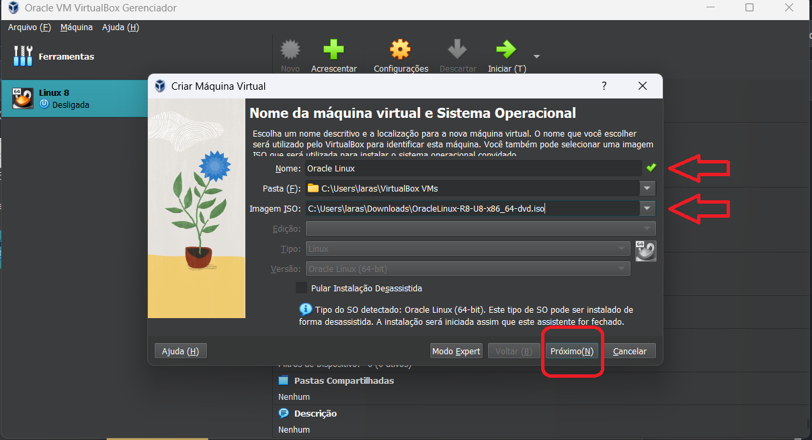

## Desafio 01 - Trilha DevSecOps na CompassUOL - Sprint 1

## Instalação de um servidor Oracle Linux 8.x em uma Virtual Box

### Ferramentas necessárias (Passo 1):

### Virtual Box

- Virtual Box é necessário para criarmos a máquina virtual.
- Se você não o possui, é necessário que o instale na sua máquina.
- [Download Virtual Box Oracle](https://www.virtualbox.org/wiki/Downloads)

### Oracle Linux 8

- Oracle Linux 8 é um sistema operacional gratuito
- [Baixe o arquivo ISO do Oracle Linux 8](https://yum.oracle.com/oracle-linux-isos.html)

**Siga o passo a passo para baixar o arquivo ISO do Oracle Linux 8**

- Acesso o link para o download acima
- Nesse desafio eu usei a versão 8.8 do Oracle Linux
  

## Criando uma máquina virtual (VM)(Passo 2):

**Abra seu Virtual Box para dar inicio a esse passo**

1. Clique no botão **NOVO** ou **NEW** na barra superior do lado direito.
2. Assim que clicar irá surgir um nova janela para nomear a sua máquina virtual, pode nomear como "Oracle Linux"
3. Na Opção **Imagem ISO**, selecione a o arquivo ISO que baixou no [Passo 1](#oracle-linux-8)
4. Por último clique em **Próximo**, como na imagem abaixo:

## Configuração de Instalação VM

1. Logo depois que clicar em **Próximo** no último item do [Passo 2](#criando-uma-maquina-virtual-vm-passo-2)
2. Coloque um nome de **usuário** e **senha**
3. Na opção **NOME DO SERVIDOR**, coloque um nome simples sem espaços só para identificar o seu servidor, e clique em **Próximo**.

## Selecionando Hardware

1. São recomendados para processamento **4GB** de RAM, selecione **4096MB** que equivalem a 4GB.
2. Clique **PRÓXIMO**

### Disco rigido

1. Deixe selecionado a opção **CRIAR UM NOVO DISCO RÍGIDO VIRTUAL AGORA**
2. No item **TAMANHO DO DISCO**, Selecione no mínimo **12GB**
3. Clique em **PRÓXIMO**.
4. E **FINALIZAR**

## Adicionando o Linux na máquina virtual (Passo 3):

1. Selecione a opção **CONFIGURAÇÕES** na barra superior a direita, isso vai abrir um menu de opções.
2. Selecione a opção **ARMAZENAMENTO**, clique no espaço vazio abaixo de **Controladora:IDE**
3. Clique no icone de CD, no item **DRIVE OPTICO**, e selecione a Imagem ISO que baixou, no meu caso está salvo como "OracleLinux-R8-U8-X86_64-dvd.iso", em seguida clique em **OK**.

### Instalando o Linux na VM

1. No canto superior a direita, clique em **INICIAR**, isso vai fazer com que inicie a VM e comece a instalação do Linux.
2. Pressione **Enter**
3. Aguarde finalizar a instalação.

.

### Configurando

1. Selecione o Idioma e **CONTINUAR**
2. Depois será redirecioado para a tela de **RESUMO DE INSTALAÇÃO**, que contém diversas opções de configuração diferentes. Vamos atualizar cada um deles, especialmente as opções com marcas de alerta, antes de iniciar o processo de instalação.

.

3. Na Seção **SISTEMA** selecione **REDE E NOME DO HOST**, e o ligue depois clique em **PRONTO**
4. Ainda na seção **SISTEMA**, selecione **DESTINO DA INSTALAÇÃO**, selecione o disco, e na seção **CONFIGURAÇÃO DE ARMAZENAMENTO**, deixe marcada a opção **AUTOMÁTICA**
5. Na seção **SISTEMA** selecione **KDUMP**, e selecione a opção **ATIVAR KDUMP**, e pronto.
6. A opção mais importante na seção **PROGRAMA** é a opção **FONTE DE INSTALAÇÃO**, clique nessa opção e selecione a opção **MÍDIA DE INSTALAÇÃO DETECTADA AUTOMATICAMENTE**. Depois disso, clique no botão **VERIFICAR**.
7. Abra a opção Seleção de programas na seção Programas

**7.1** Mantenha a opção **SERVIDOR COM GUI**, e selecione a opção **FERRAMENTAS DE DESENVOLVIMENTO** no menu a direita, por fim clique em pronto. 8. Agora, na Seção **CONFIGURAÇÕES DO USUARIO**, selecione a opção **SENHA ROOT**, e coloque uma senha, depois clique em **PRONTO** 9. Depois de atualizar todas essas informações pode dar inicio a instalação do Software, no botão **INICIAR A INSTALAÇÃO** e aguarde a instalação ser feita. 10. Quando finalizado a instalção clique em **REINICIAR O SISTEMA**

.

## Finalizando instalação

- Para Finalizar dê aceite no contrato de licença.
- E por fim clique em **FINISH CONFIGURATION**

.
